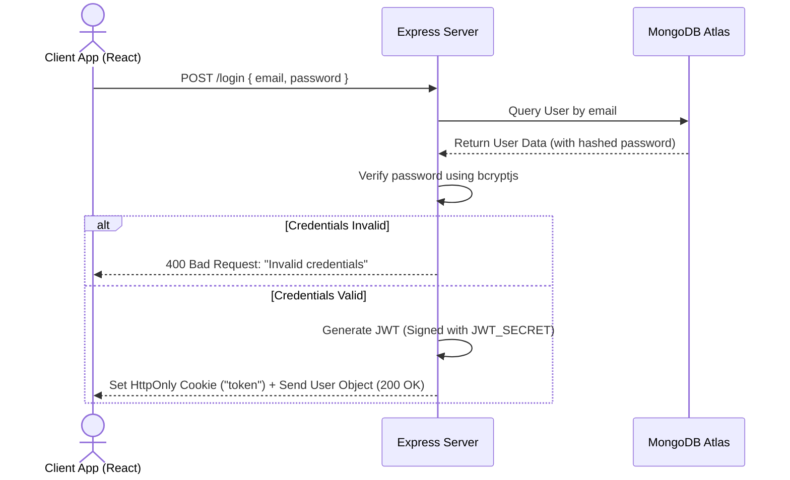
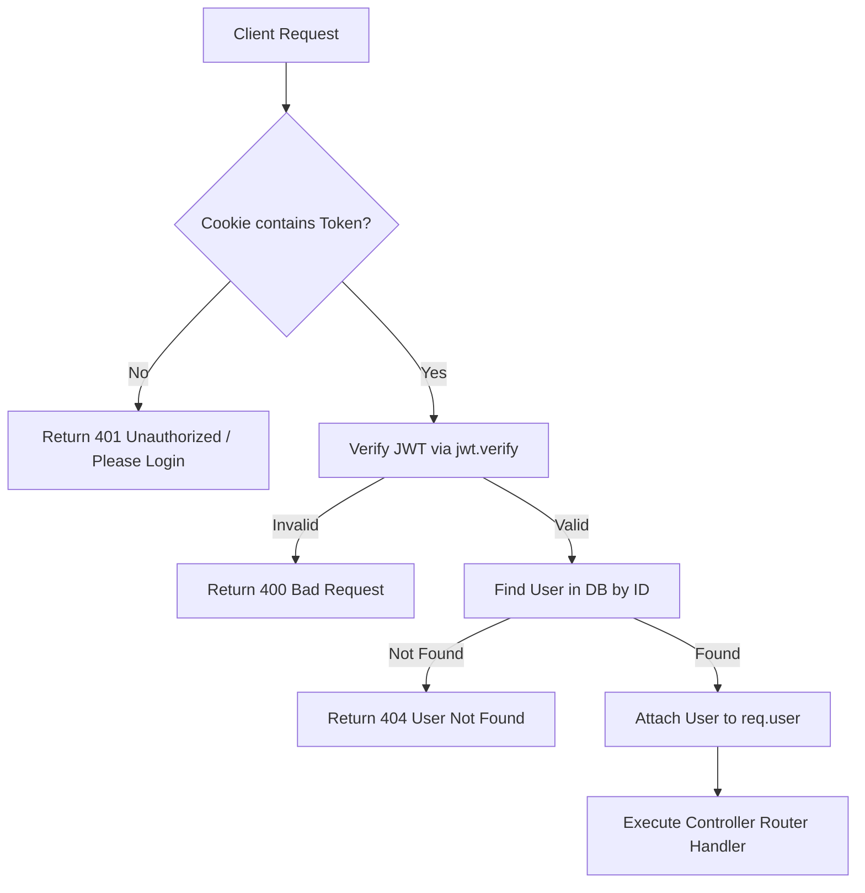

# 💻 gitConnect

[](https://react.dev/)
[](https://nodejs.org/)
[](https://expressjs.com/)
[](https://www.mongodb.com/)
[](https://vite.dev/)
[](https://jwt.io/)

A premium, full-stack developer matchmaking and networking application. `gitConnect` lets developers showcase their stacks, browse other engineers in an intuitive swipable card interface, edit their profiles, and establish connections for project collaborations, team building, or networking.

---

## 🌟 Architecture & Flow

### 1. User Authentication & Verification Flow


### 2. Protected Session Pipeline


---

## ✨ Features & Deep Dive

### 🔐 Authentication & Session Security
* **Stateless Token Management:** Employs JSON Web Tokens (JWT) signed on the server and verified on protected route access.
* **HTTP-Only Cookies:** Tokens are stored in browser cookies under `httpOnly: true` configurations to mitigate Cross-Site Scripting (XSS) risks.
* **Cryptographic Hashing:** User passwords are encrypted with `bcryptjs` using a salt work factor of `10`.
* **Auto-Login:** When the application mounts, the React client automatically fires `/api/profile/view` to restore the user session seamlessly if active cookies are detected.

### 🛡️ Schema-Level Validation & Sanitization
* **Mongoose Schema Validators:** Enforces specific data criteria directly in the model:
  * Minimum age requirement of `18`.
  * Gender values restricted via custom array checking to `['male', 'female', 'others']`.
  * Email format checking via the `validator` package.
  * Fields like `firstName` and `email` are trimmed, lowercased, and set as mandatory.
  * Duplicate signups are blocked via Unique Indexes.

### 🎨 Glassmorphic Interface & Premium Aesthetics
* **Dynamic Backdrop Blur:** Card elements use `backdrop-filter: blur(16px)` layered on top of a dark radial mesh backdrop.
* **Swipable Matching Engine:** Intuitive matching buttons allowing users to swipe ("Like" or "Pass") developer profiles.
* **Custom Skills Builder:** Automatically generates matching skill tag lists (e.g., `React`, `Golang`, `Docker`) based on demographic indexes to simulate developer profiles.

---

## 📁 Repository Structure

```text
gitConnect/
├── backend/                  # Express REST API Server
│   ├── src/
│   │   ├── config/           # Database configuration
│   │   ├── middlewares/      # Authentication middleware (userAuth)
│   │   ├── models/           # Mongoose schemas (User schema + validations)
│   │   └── routes/           # Modular Express routers (auth, profile, user)
│   ├── app.js                # App entrypoint & middleware registrations
│   └── .env                  # Environment configuration (ignored)
│
└── frontend/                 # Vite + React Single Page Application
    ├── src/
    │   ├── components/       # Reusable components (NavBar, UserCard)
    │   ├── pages/            # View pages (Login, Feed, Profile)
    │   ├── utils/            # Context providers (UserContext)
    │   ├── index.css         # Global design system styles
    │   ├── main.jsx          # DOM rendering root
    │   └── App.jsx           # App shell & router configurations
    └── vite.config.js        # Vite configurations (includes API proxy settings)
```

---

## 🔌 API Blueprint

### Authentication Endpoints

#### `POST /signup`
Registers a new developer account.
* **Request Body:**
  ```json
  {
    "firstName": "Jane",
    "lastName": "Smith",
    "email": "jane@example.com",
    "password": "StrongPassword123!",
    "age": 28,
    "gender": "female"
  }
  ```
* **Success Response (201 Created):**
  ```text
  "User registered successfully!"
  ```

#### `POST /login`
Authenticates credentials and issues a cookie token.
* **Request Body:**
  ```json
  {
    "email": "jane@example.com",
    "password": "StrongPassword123!"
  }
  ```
* **Headers:** Sets `Set-Cookie: token=<jwt_session_token>; HttpOnly`
* **Success Response (200 OK):**
  ```json
  {
    "message": "Login successful!",
    "user": {
      "_id": "603d433...",
      "firstName": "Jane",
      "lastName": "Smith",
      "email": "jane@example.com",
      "age": 28,
      "gender": "female"
    }
  }
  ```

#### `POST /logout`
Clears active cookies.
* **Success Response (200 OK):**
  ```text
  "Logout successful!"
  ```

---

### Profile Endpoints

#### `GET /profile/view`
Fetches authenticated user details.
* **Requirement:** Must include a valid `token` cookie.
* **Success Response (200 OK):** Returns matching user object.

#### `PATCH /profile/edit`
Modifies profile characteristics.
* **Requirement:** Must include a valid `token` cookie.
* **Request Body:** (Only `firstName`, `lastName`, `age`, and `gender` can be modified)
  ```json
  {
    "firstName": "Janice",
    "age": 29
  }
  ```
* **Success Response (200 OK):**
  ```json
  {
    "message": "Janice, your profile updated successfully!",
    "data": { ... }
  }
  ```

---

## ⚙️ Setup & Installation

### Step 1: Clone and Configure Environment
1. Clone the repository and navigate to the project directory:
   ```bash
   git clone https://github.com/harsimar-singh03/gitConnect.git
   cd gitConnect
   ```

### Step 2: Run Backend
1. Go to the backend directory and install dependencies:
   ```bash
   cd backend
   npm install
   ```
2. Create a `.env` file inside `backend/`:
   ```env
   PORT=7000
   MONGODB_URI=mongodb+srv://<username>:<password>@cluster.mongodb.net/gitConnect
   JWT_SECRET=your_secret_key_here
   ```
3. Run the API server:
   ```bash
   node app.js
   ```

### Step 3: Run Frontend
1. Open a new terminal, navigate to the frontend directory, and install dependencies:
   ```bash
   cd frontend
   npm install
   ```
2. Start the Vite React development server:
   ```bash
   npm run dev
   ```
3. Open **`http://localhost:5173/`** in your browser.
